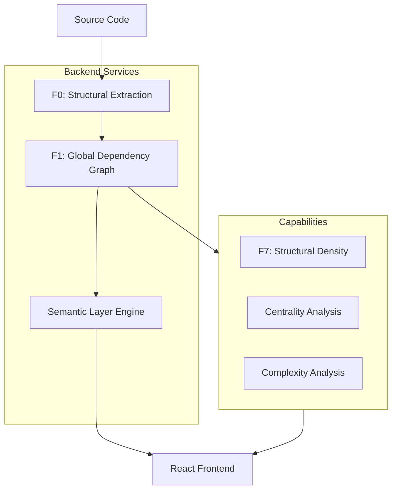

# CBCT Technical Architecture

This document provides a deep dive into the internal systems, data structures, and algorithms that power the CodeBase Cartographic Tool.

## 🏗️ System Overview

CBCT uses a multi-layered architecture to transform raw source code into semantic, interactive maps.



---

## 🔧 Backend Services

### 1. Structural Extraction (F0)
**File**: `server/src/services/structuralExtraction.js`

The extraction service parses the repository and builds the initial metadata tree.
- **Language Support**: 20+ languages supported via regex-based semantic parsing.
- **Metrics**: Calculates LOC, file size, and extension-based metadata.
- **Import Resolution**: Resolves relative and absolute imports into normalized paths.

### 2. Global Dependency Graph (F1)
**File**: `server/src/services/globalDependencyGraph.js`

Maintains the authoritative graph representation of the codebase.
- **Graph Structure**: Nodes (Units) and Edges (Dependencies).
- **Stability**: Maintains stable node IDs across incremental scans.
- **Analysis**: Provides methods for circular dependency detection, in-degree/out-degree calculation, and transitive dependency tracing.

### 3. Semantic Layer Engine
**File**: `server/src/services/semanticLayerEngine.js`

The "brain" of the adaptive visualization. It dynamically abstracts the graph based on the repository size.
- **Unit Aggregation**: Files -> Folders -> Semantic Clusters.
- **Progressive Disclosure**: Manages the 4 semantic layers (Orientation, Structural, Impact, Detail).

---

## ⚡ Algorithms & Logic

### F7: Structural Density (Mental Load Signal)
Visualizes "thinking difficulty" through jitter animation rather than metrics.

**Formula**:
`Density = (Direct Connections + Nearby Nodes) / (Total Graph Size)`

**Category Thresholds**:
- **High (>0.6)**: 2-3 Hz wobble animation, "High Effort" signal.
- **Medium (0.3-0.6)**: Standard rendering, "Normal Effort" signal.
- **Low (<0.3)**: Static, calm aesthetic, "Easy/Stable" signal.

**Animation Math**:
```javascript
const phase = jitterData.phase + (Date.now() * 0.003);
const offsetX = Math.sin(phase) * (2 / globalScale);
const offsetY = Math.cos(phase * 0.8) * (2 / globalScale) * 0.7;
```

### Shortest Path Analysis (Breadth-First Search)
Used for the Pathfinding feature to trace dependencies between units.
```javascript
const queue = [[startId]];
const visited = new Set([startId]);
// ... standard BFS to find path to endId
```

---

## 📡 API Layer

### Analysis Endpoints
| Endpoint | Method | Description |
|----------|--------|-------------|
| `/api/analysis/dependencies` | POST | Initial semantic graph build |
| `/api/analysis/expand` | POST | Reveal unit internals (Layer 2+) |
| `/api/analysis/impact` | POST | Trace dependency chain (Layer 3) |
| `/api/analysis/git/churn` | POST | Historical modification hotspots |
| `/api/analysis/git/impact` | POST | PR diff vs main branch risk |

---

## 📁 File Structure Overview

### Backend (`server/src/`)
- `index.js`: Server entry & route registration.
- `routes/`: API layer (repository, analysis, graph).
- `services/`: Core logic (extraction, engine, git, complexity).

### Frontend (`client/src/`)
- `components/`: UI layer (GraphCanvas, UnitCard, Sidebar).
- `store/`: Zustand state management (global graph, selection, layers).
- `services/`: API client for backend communication.

---

## 📈 Performance & Scalability

- **Large Repo Threshold**: > 500 files triggers semantic clustering.
- **Safety Limits**: 
    - Max 20 units in initial view (Layer 1).
    - Max 300 total nodes visible at once.
    - Max 150 nodes during internal expansion.
- **Optimization**: Chunked parallel processing for file extraction.

---
**Clear thinking precedes confident code.**
